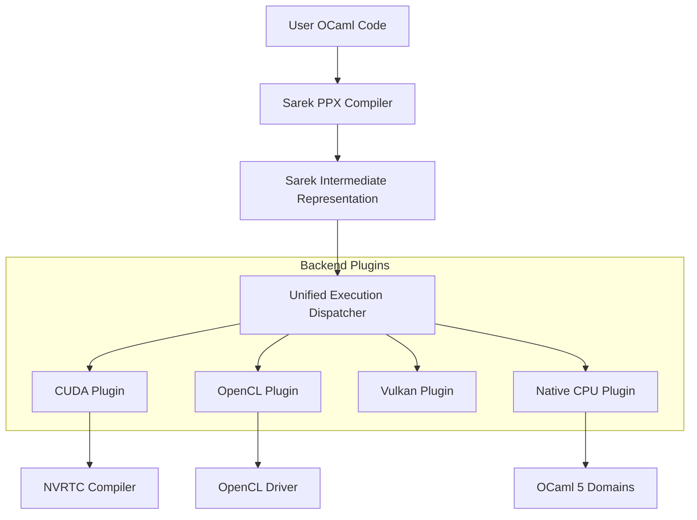

# Sarek & SPOC Architecture

The project is structured into two main layers: **Sarek** (the high-level DSL and compiler) and **SPOC** (the low-level runtime and plugin framework).

## High-Level Overview

## 1. Sarek: The DSL Layer
Sarek is responsible for the developer-facing experience. It uses a **PPX (Pre-Processor Extension)** to allow writing GPU code in standard OCaml syntax.

- **Frontend**: The PPX parses `[%kernel ...]` blocks.
- **Typing**: It performs a second typing pass to ensure the OCaml code is compatible with GPU constraints (no closures, no arbitrary heap allocation).
- **Lowering**: The typed AST is lowered into a specialized **Sarek IR (Intermediate Representation)**.
- **Code Generation**: The IR is either translated into C-like GPU source code (for JIT backends) or converted into an OCaml function (for the Native backend).

## 2. SPOC: The Runtime Layer
SPOC (*SIMT Programming for OCaml*) provides the infrastructure to manage hardware.

- **Unified API**: A backend-agnostic interface for device detection, memory allocation, and kernel launching.
- **Memory Management**: Handles `Vector.t` objects, which bridge OCaml's GC-managed heap and the GPU's private memory.
- **Plugin System**: Every backend (CUDA, OpenCL, etc.) is a standalone plugin that registers itself with the central SPOC registry at runtime.

## 3. Execution Pipeline

When you call `Execute.run kernel`, the following happens:

1. **Discovery**: SPOC checks which backends are available on your system.
2. **Selection**: It selects the best available device (prioritizing GPU over CPU).
3. **Monomorphization**: If the kernel uses polymorphic types, Sarek specializes the IR for the concrete types of the arguments.
4. **JIT Compilation**: For GPU backends, the IR is translated to source code (e.g., CUDA C) and compiled by the driver's JIT compiler.
5. **Caching**: Compiled kernels are cached in memory (and sometimes on disk for Vulkan) to avoid recompilation on subsequent calls.
6. **Execution**: The kernel is launched on the GPU asynchronously. SPOC manages the streams and events to ensure data consistency.

## 4. The BSP Model (Supersteps)
Sarek implements the **Bulk Synchronous Parallel (BSP)** model. This allows developers to write complex algorithms using `let%superstep` blocks. The runtime ensures that all threads reach a synchronization barrier between supersteps, providing a clear and safe way to manage data dependencies in parallel code.
